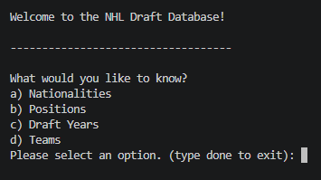
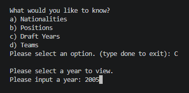
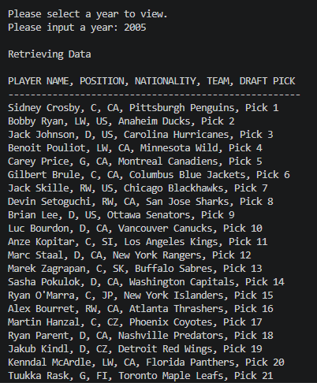
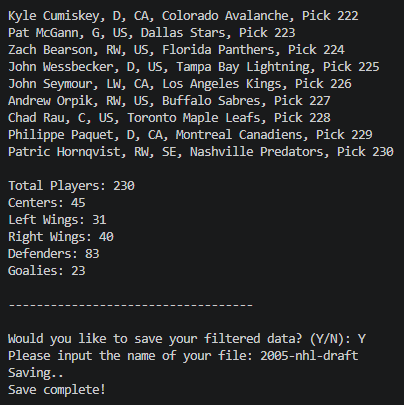

# NHL Draft Data Filtration & Transformation

This is a Python-based program that generates filtered NHL draft datasets based on user-defined criteria.

The different critera you can filter by are:

- **Nationality**

_Input the 2-letter country abbreviation (e.g., CA for Canada, SE for Sweden)_
- **Position**

_Input the position abbreviation (e.g., C for Center, LW for Left Wing)_
- **Draft Year**

_Input a valid year within the dataset (1963–2022) to return all players drafted in that year_
- **Team**

_The program generates a list of NHL franchises included in the dataset._
_You can select a team by entering its corresponding number to return all players drafted by that franchise_

After selecting your filters, the program will display all matching players.

The information shown includes:

- Player Name
- Position
- Team Drafted By
- Draft Year
- Draft Position

Once all players are displayed, the program also shows:

- Total number of players returned
- Number of players per position

You will then have the option to export the filtered results into a new CSV file with a custom name.

## Example Usage

### Program Startup

### User Input

### Output

### Statistics + Export

# Dataset Used:
"NHL Draft Hockey Player Data (1963–2022)" by Matt OP
https://www.kaggle.com/datasets/mattop/nhl-draft-hockey-player-data-1963-2022

Total Rows: 12,251

# Project Context
This project was used as a final project for my first Python Programming course at NSCC.
Designed to display skills in data filtration & transformation, and creating a user-focused program.

PLEASE NOTE: This was before I began to start learning pandas/numpy and various other packages.

